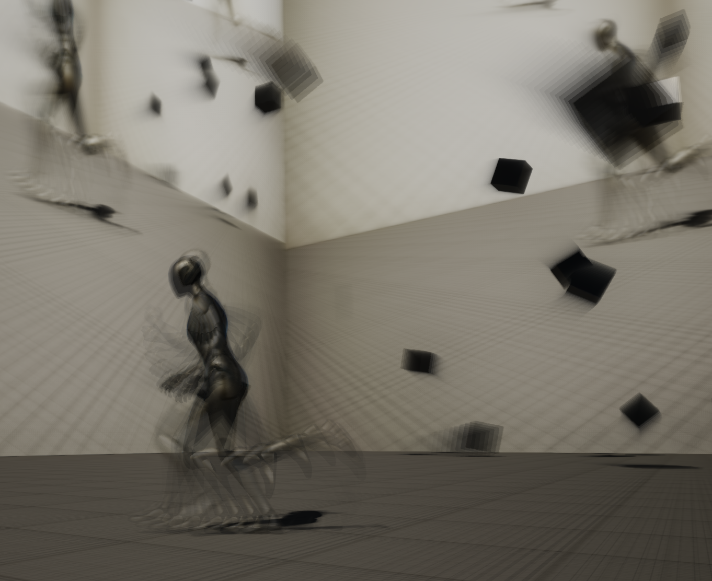
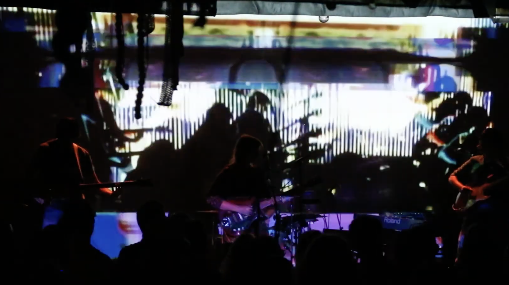
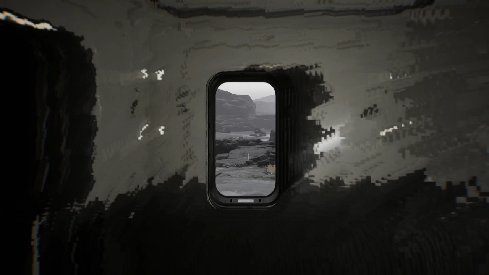
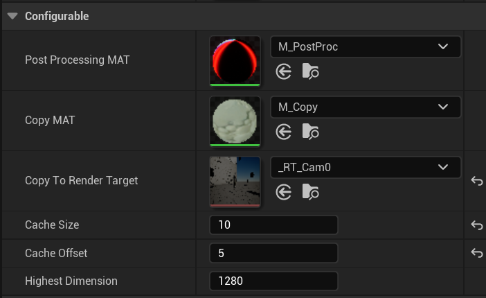
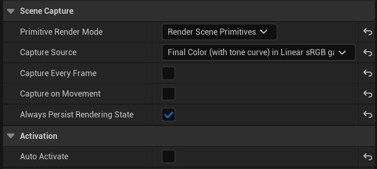
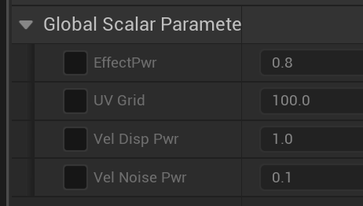
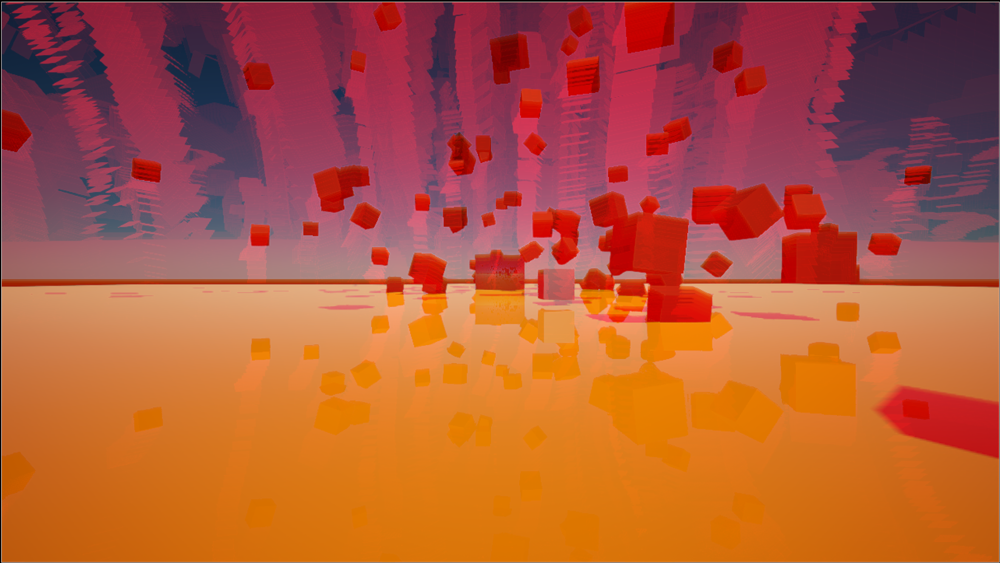
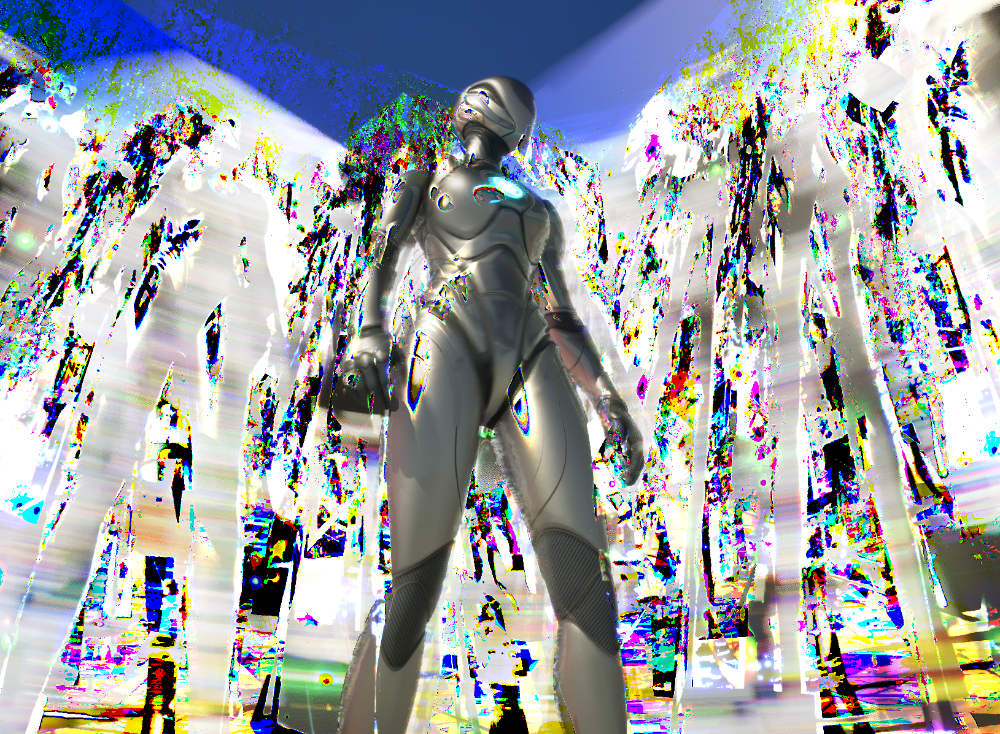

# RSCH - PostProcessing pipeline and feedback loop.

## Introduction

In this project, I will explore blueprint ways for custom post-processing in Unreal and how its Post Process Material allows developers to inject custom logic into the rendering pipeline, leveraging existing buffers (SceneColor, SceneDepth, Velocity, etc), focusing initially on creating a simple trails effect and gradually extending it with more advanced features like displacement driven by various render buffers, datamosh and glitches, feedback loops utilizing Render Targets to store the previous frame’s image and feed it back into the current frame.

The end goal is to produce a module or pack of tools that can be comfortably and efficiently reused in different Unreal Engine scenes. This research aims to investigate existing methods and experiment with new approaches.

<!--  -->

## State of the Art

The video feedback effect—where a video camera captures its own output displayed on a monitor—has evolved from an unintended technical glitch to a significant artistic and cultural phenomenon.

Discovered shortly after the invention of the first video recorder by Charlie Ginsburg in 1956, video feedback was initially seen as a problem. Technicians avoided it because pointing a camera at its own monitor could overload early video pickups, potentially damaging equipment and causing screen burn-in.

In the 1960s, artists began to explore video feedback's creative potential.By the 1970s and 1980s, video feedback found its way into mainstream media. Notably, the opening title sequence of the British TV series Doctor Who (1963–1973) utilized a technique known as "howl-around," a form of video feedback. Music videos like Queen's "Bohemian Rhapsody" (1975) and Earth, Wind & Fire's "September" (1978) also employed feedback effects to create visually captivating experiences.

<!--
Cellular automata (CAs) are mathematical models used to simulate complex systems using simple, local rules. Just like video feedback loops create intricate visual patterns from a recursion, generating emergent patterns.

 -->

### Datamosh Effect plugin for UE

> Post process shader that creates a frame blending effect by simulating a video editing technique in which the footage is manipulated to look "glitchy", usually by manual compression.

[Fab](https://www.fab.com/listings/f54fa19f-b19a-4330-88a6-a467f6a00bca) | [Youtube](https://www.youtube.com/watch?v=Uapad3pVxBY)

This plugin made with low level C++ pipeline hooks. I'm going to explore the boundaries of what is allowed and how deep I can get inside of engine with blueprints to make it accessable even for not programmers. Looking ahead, I should say that this is actually enough!

## Approach

### Modular Structure
- **`M_PP_Feedback`** – A material that blends the last frame with the current one.
- **`AC_CameraCapture`** – The main component for the pawn that dynamically creates and renders RenderTargets while adjusting the material of the post-process volume.
- **`SceneCapture_Feedback`** - adjusted SceneCapture2D component.
- **`MM_PP_Feedback`** - PostProcess Material where you can adjust all custom logic for your visual effect.

### User Project Structure
- **PostProcess Volume** with an empty slot for the `M_PP_Feedback` material in the pipeline.
- **SceneCapture2D** as a child of the main camera, precisely aligned with its parent.

### Initialization

#### `AC_CameraCapture` Parameters

- **Cache Size** – The number of RenderTargets to be created.
- **Cache Offset** – Defines the delay in frames. Useful for cached feedback.
- **Highest Dimension** – Sets a resolution limit to avoid excessive processing with 2K textures. By default, the component creates scaled `1280` textures, or full-size if set to `0`.
- **Copy to Render Target** *(optional)* – Assign a RenderTarget if you want to use it as a model texture somewhere.

#### `SceneCapture2D` Parameters

Since all operations are handled manually, any automatic actions should be disabled. It’s not immediately obvious, but "Persist State" is not enabled by default—unlike the standard camera settings. I'll experiment with other "Final Color" buffers in the future.

#### `MM_PP_Feedback` Parameters

## Install
Migrate **ThirdPerson**, **Characters**, **StarterContent**, **LevelPrototyping** from another project or use symlinks. Keep it immutable!

## Results

## Problems

### SceneCapture
G-buffer textures aren't exposed directly from the Unreal render pipeline. The only way to access them is by calling Capture() with a SceneCapture, which essentially triggers another full render. It introduces unnecessary overhead.

### Velocity G-buffer
The velocity buffer isn't linear as expected—it seems like the vectors are calculated from the lower-left corner of the screen, which makes interpretation tricky.

### Alpha in PostProcessing
The alpha channel isn't available in post-processing, but it could be useful for feeding back a mask through one of the channels.